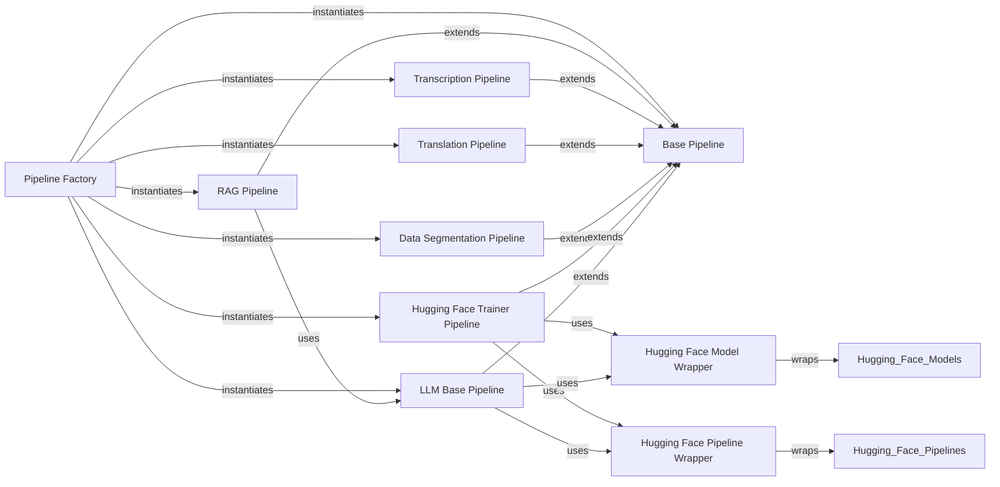

## Component Details

The `AI Pipeline Framework` is designed as a modular and extensible system for executing diverse AI-driven tasks. Its core strength lies in abstracting complex AI models and data processing into a consistent, easy-to-use interface.

### Pipeline Factory

This component acts as the central entry point for dynamically instantiating various AI pipelines. It provides a standardized mechanism to create and manage pipeline instances based on configuration, ensuring a consistent way to access different AI functionalities.

**Related Classes/Methods**:

- <a href="https://github.com/neuml/txtai/blob/master/src/python/txtai/agent/factory.py#L1-L1" target="_blank" rel="noopener noreferrer">`factory` (1:1)</a>

### Base Pipeline

This is the abstract base class that defines the common interface and fundamental methods for all AI pipeline implementations within the framework. It establishes the blueprint for how pipelines should operate, ensuring consistency across diverse AI tasks.

**Related Classes/Methods**:

- <a href="https://github.com/neuml/txtai/blob/master/src/python/txtai/agent/base.py#L1-L1" target="_blank" rel="noopener noreferrer">`base` (1:1)</a>

### RAG Pipeline

This specialized pipeline implements Retrieval Augmented Generation (RAG), combining information retrieval with large language model capabilities to generate more informed and contextually relevant responses.

**Related Classes/Methods**:

- <a href="https://github.com/neuml/txtai/blob/master/src/python/txtai/api/routers/rag.py#L1-L1" target="_blank" rel="noopener noreferrer">`rag` (1:1)</a>

### Transcription Pipeline

This pipeline is dedicated to audio-to-text conversion, processing audio input and generating textual transcripts.

**Related Classes/Methods**:

- <a href="https://github.com/neuml/txtai/blob/master/src/python/txtai/api/routers/transcription.py#L1-L1" target="_blank" rel="noopener noreferrer">`transcription` (1:1)</a>

### Translation Pipeline

This pipeline performs text translation, converting text from one language to another.

**Related Classes/Methods**:

- <a href="https://github.com/neuml/txtai/blob/master/src/python/txtai/api/routers/translation.py#L1-L1" target="_blank" rel="noopener noreferrer">`translation` (1:1)</a>

### Data Segmentation Pipeline

This pipeline focuses on dividing input data into smaller, meaningful segments, which is crucial for processing large datasets or preparing data for specific AI models.

**Related Classes/Methods**:

- <a href="https://github.com/neuml/txtai/blob/master/src/python/txtai/api/routers/segmentation.py#L1-L1" target="_blank" rel="noopener noreferrer">`segmentation` (1:1)</a>

### Hugging Face Trainer Pipeline

This pipeline facilitates the training of models, particularly those from the Hugging Face Transformers library, within the `txtai` framework.

**Related Classes/Methods**:

- <a href="https://github.com/neuml/txtai/blob/master/src/python/txtai/pipeline/train/hftrainer.py#L1-L1" target="_blank" rel="noopener noreferrer">`hftrainer` (1:1)</a>

### LLM Base Pipeline

This component provides a foundational interface and common functionalities for various Large Language Model (LLM) operations, serving as a base for more specialized LLM-driven pipelines like RAG.

**Related Classes/Methods**:

- <a href="https://github.com/neuml/txtai/blob/master/src/python/txtai/api/routers/llm.py#L1-L1" target="_blank" rel="noopener noreferrer">`llm` (1:1)</a>

### Hugging Face Model Wrapper

This component provides a standardized wrapper for integrating and utilizing Hugging Face models within the `txtai` pipeline ecosystem, abstracting away direct Hugging Face API interactions.

**Related Classes/Methods**:

- <a href="https://github.com/neuml/txtai/blob/master/src/python/txtai/pipeline/hfmodel.py#L1-L1" target="_blank" rel="noopener noreferrer">`hfmodel` (1:1)</a>

### Hugging Face Pipeline Wrapper

This component wraps Hugging Face's high-level pipeline abstraction, allowing `txtai` to leverage pre-built Hugging Face pipelines for common tasks while maintaining consistency with the `txtai` pipeline interface.

**Related Classes/Methods**:

- <a href="https://github.com/neuml/txtai/blob/master/src/python/txtai/pipeline/hfpipeline.py#L1-L1" target="_blank" rel="noopener noreferrer">`hfpipeline` (1:1)</a>

### [FAQ](https://github.com/CodeBoarding/GeneratedOnBoardings/tree/main?tab=readme-ov-file#faq)