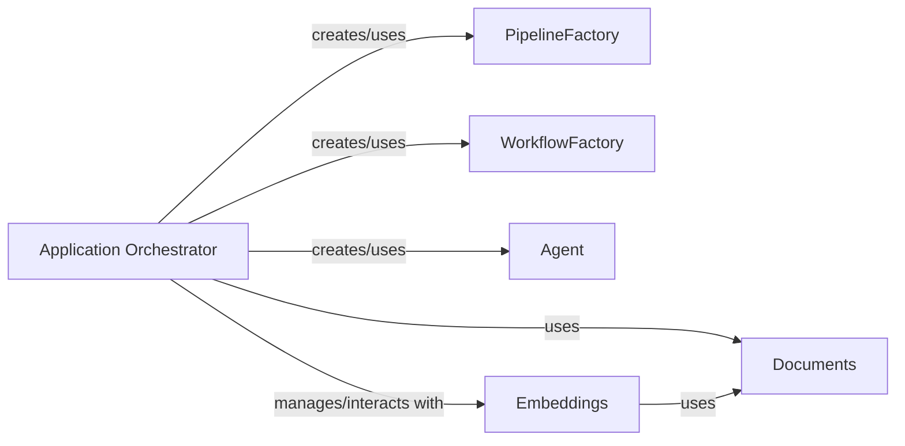

## Component Details

The `Application Orchestrator` in `txtai` is the central control unit, responsible for initializing, configuring, and managing all core functionalities. It acts as the primary entry point for the system, coordinating interactions between various components based on the application's configuration. It ensures that all services are properly set up and accessible.

### Application Orchestrator

The `Application` class is the core orchestrator in `txtai`. It reads YAML configurations to set up and manage various AI components, including pipelines, workflows, agents, and embeddings. It handles the lifecycle of these components, from creation and initialization to managing their interactions and ensuring proper data flow. It also provides methods for common operations like search, indexing, and transformations, acting as a unified interface to the underlying AI capabilities.

**Related Classes/Methods**:

- <a href="https://github.com/neuml/txtai/blob/master/src/python/txtai/app/base.py#L1-L1" target="_blank" rel="noopener noreferrer">`txtai.app.base.Application` (1:1)</a>

### PipelineFactory

A static factory class responsible for creating and retrieving various pipeline instances (e.g., `Transcription`, `Segmentation`, `RAG`, `Translation`, `HFTrainer`) based on configuration. It centralizes the instantiation logic for different AI tasks.

**Related Classes/Methods**:

- <a href="https://github.com/neuml/txtai/blob/master/src/python/txtai/pipeline/factory.py#L1-L1" target="_blank" rel="noopener noreferrer">`txtai.pipeline.factory.PipelineFactory` (1:1)</a>

### WorkflowFactory

A static factory class for creating and managing workflow instances, which define sequences of operations or tasks. It resolves and creates individual tasks within a workflow.

**Related Classes/Methods**:

- <a href="https://github.com/neuml/txtai/blob/master/src/python/txtai/workflow/factory.py#L1-L1" target="_blank" rel="noopener noreferrer">`txtai.workflow.factory.WorkflowFactory` (1:1)</a>

### Agent

Represents an AI agent capable of performing complex tasks, often by leveraging language models and tools. The `Application` orchestrator creates and manages these agents.

**Related Classes/Methods**:

- <a href="https://github.com/neuml/txtai/blob/master/src/python/txtai/agent/base.py#L1-L1" target="_blank" rel="noopener noreferrer">`txtai.agent.base.Agent` (1:1)</a>

### Embeddings

Manages the creation, loading, indexing, searching, and transformation of vector embeddings. It is crucial for semantic search and similarity operations. The `Application` orchestrator directly interacts with and manages the lifecycle of the `Embeddings` component.

**Related Classes/Methods**:

- <a href="https://github.com/neuml/txtai/blob/master/src/python/txtai/embeddings/base.py#L1-L1" target="_blank" rel="noopener noreferrer">`txtai.embeddings.base.Embeddings` (1:1)</a>

### Documents

A utility class for managing and buffering documents before they are indexed into the embeddings. The `Application` orchestrator uses this component to stage documents for indexing operations.

**Related Classes/Methods**:

- <a href="https://github.com/neuml/txtai/blob/master/src/python/txtai/embeddings/index/documents.py#L1-L1" target="_blank" rel="noopener noreferrer">`txtai.embeddings.index.documents.Documents` (1:1)</a>

### [FAQ](https://github.com/CodeBoarding/GeneratedOnBoardings/tree/main?tab=readme-ov-file#faq)