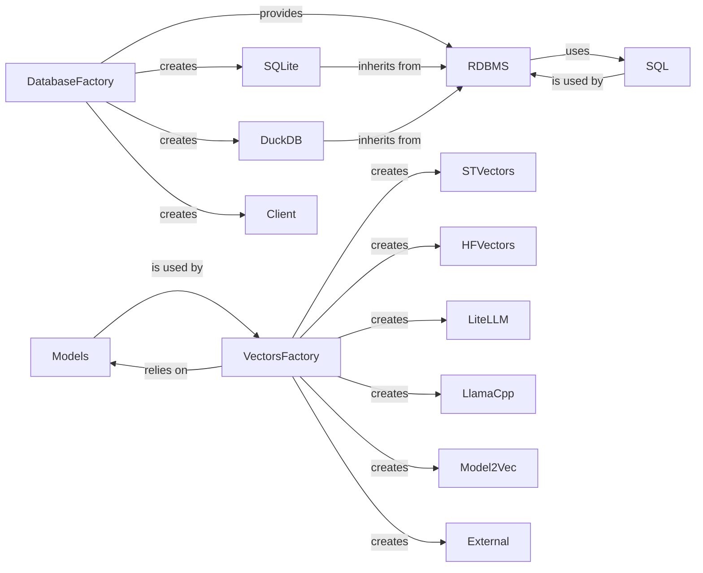

## Component Details

This subsystem provides foundational services for loading, managing, and providing access to AI models (for vector generation and other tasks) and for persistent storage and retrieval of data. It abstracts the complexities of model handling, device management, and various database interactions (e.g., RDBMS, SQL processing), serving as a shared infrastructure layer.

### Models

This component offers a comprehensive set of static utility methods for managing and interacting with machine learning models and computational devices. It handles device detection and selection (CPU, GPU, MPS), model loading (supporting ONNX and various Hugging Face Transformers models), tokenizer loading, and inferring model tasks. It acts as a foundational layer for efficient model deployment and execution.

**Related Classes/Methods**:

- <a href="https://github.com/neuml/txtai/blob/master/src/python/txtai/models/models.py#L1-L1" target="_blank" rel="noopener noreferrer">`txtai.models.models` (1:1)</a>

### VectorsFactory

This factory class is responsible for instantiating diverse vector models, abstracting the creation logic for different vectorization methods such as Sentence Transformers, Word Vectors, LiteLLM, LlamaCpp, and Hugging Face Transformers. It dynamically selects the appropriate vector model based on the provided configuration, enabling flexible embedding generation from various data types.

**Related Classes/Methods**:

- <a href="https://github.com/neuml/txtai/blob/master/src/python/txtai/vectors/factory.py#L1-L1" target="_blank" rel="noopener noreferrer">`txtai.vectors.factory` (1:1)</a>

### DatabaseFactory

This factory class serves as the primary entry point for instantiating various database types (e.g., SQLite, DuckDB, or custom database clients) based on the provided configuration. It abstracts the underlying database creation logic, allowing the system to seamlessly switch between different database backends.

**Related Classes/Methods**:

- <a href="https://github.com/neuml/txtai/blob/master/src/python/txtai/database/factory.py#L1-L1" target="_blank" rel="noopener noreferrer">`txtai.database.factory` (1:1)</a>

### RDBMS

This component serves as the abstract base class for relational database management system implementations within `txtai`. It defines the core interface and implements common database operations such as inserting, querying, deleting, and reindexing data. It manages the database connection lifecycle, session management, and schema initialization, providing a consistent interface for data persistence. It also includes logic for integrating similarity search results into SQL queries.

**Related Classes/Methods**:

- <a href="https://github.com/neuml/txtai/blob/master/src/python/txtai/database/rdbms.py#L1-L1" target="_blank" rel="noopener noreferrer">`txtai.database.rdbms` (1:1)</a>

### SQL

This utility class is responsible for parsing, tokenizing, and normalizing SQL queries specifically tailored for `txtai`. It extracts various SQL clauses (SELECT, WHERE, GROUP BY, etc.) and is capable of integrating placeholders for similarity search, making queries more powerful and adaptable for AI-driven data retrieval. It works in conjunction with a database resolver to map query column names to actual database column names.

**Related Classes/Methods**:

- <a href="https://github.com/neuml/txtai/blob/master/src/python/txtai/database/sql/base.py#L1-L1" target="_blank" rel="noopener noreferrer">`txtai.database.sql.base` (1:1)</a>

### [FAQ](https://github.com/CodeBoarding/GeneratedOnBoardings/tree/main?tab=readme-ov-file#faq)