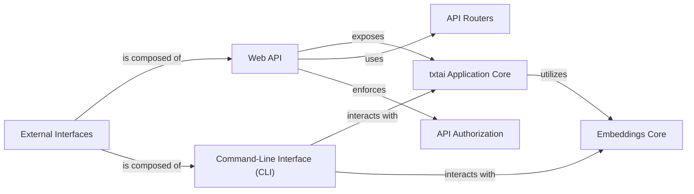

## Component Details

This section provides a detailed overview of the `External Interfaces` component within `txtai`, which serves as the primary gateway for users and applications to interact with the system's capabilities. It is fundamentally composed of two main sub-components: the **Web API** and the **Command-Line Interface (CLI)**, each offering distinct interaction paradigms. The following components are central to the `External Interfaces` subsystem due to their direct involvement in exposing `txtai`'s functionalities and managing external interactions: External Interfaces (Overall Component), Web API, Command-Line Interface (CLI), txtai Application Core (`txtai.app.base.Application`), API Routers (`txtai.api.routers`), API Authorization (`txtai.api.authorization.Authorization`), Embeddings Core (`txtai.embeddings.base.Embeddings`).

### External Interfaces

The overarching layer responsible for exposing `txtai`'s functionalities to external users and applications, encompassing both programmatic (Web API) and interactive (CLI) access.

**Related Classes/Methods**: _None_

### Web API

This sub-component provides a FastAPI-based RESTful API, allowing programmatic access to `txtai`'s functionalities. It handles incoming HTTP requests, processes them, and returns responses, enabling seamless integration with other applications.

**Related Classes/Methods**:

- <a href="https://github.com/neuml/txtai/blob/master/src/python/txtai/api/application.py#L1-L1" target="_blank" rel="noopener noreferrer">`txtai.api.application` (1:1)</a>

- <a href="https://github.com/neuml/txtai/blob/master/src/python/txtai/api/authorization.py#L1-L1" target="_blank" rel="noopener noreferrer">`txtai.api.authorization` (1:1)</a>

### Command-Line Interface (CLI)

This sub-component provides an interactive command-line environment for direct user interaction with `txtai`. Users can issue commands to perform operations like loading models, searching, and executing workflows.

**Related Classes/Methods**:

- <a href="https://github.com/neuml/txtai/blob/master/src/python/txtai/console/base.py#L1-L1" target="_blank" rel="noopener noreferrer">`txtai.console.base` (1:1)</a>

### txtai Application Core

The central component encapsulating the core business logic and functionalities of `txtai`, such as search, workflow execution, and model management. Both the Web API and CLI interact with this core to perform operations.

**Related Classes/Methods**:

- <a href="https://github.com/neuml/txtai/blob/master/src/python/txtai/app/base.py#L1-L1" target="_blank" rel="noopener noreferrer">`txtai.app.base.Application` (1:1)</a>

### API Routers

A collection of modules (e.g., `embeddings.py`, `workflow.py`, `search.py`) that define specific API endpoints and their associated logic. Each router groups related API operations, contributing to the modularity of the Web API.

**Related Classes/Methods**:

- <a href="https://github.com/neuml/txtai/blob/master/src/python/txtai/api/routers/embeddings.py#L1-L1" target="_blank" rel="noopener noreferrer">`txtai.api.routers.embeddings` (1:1)</a>

- <a href="https://github.com/neuml/txtai/blob/master/src/python/txtai/api/routers/workflow.py#L1-L1" target="_blank" rel="noopener noreferrer">`txtai.api.routers.workflow` (1:1)</a>

- `txtai.api.routers.search` (1:1)

### API Authorization

Handles authentication and authorization for API access, ensuring that only authorized requests can access `txtai`'s functionalities via the Web API.

**Related Classes/Methods**:

- <a href="https://github.com/neuml/txtai/blob/master/src/python/txtai/api/authorization.py#L1-L1" target="_blank" rel="noopener noreferrer">`txtai.api.authorization.Authorization` (1:1)</a>

### Embeddings Core

Manages the embeddings index and provides functionalities related to vector embeddings, such as similarity search and indexing. It is a key component for `txtai`'s semantic capabilities.

**Related Classes/Methods**:

- <a href="https://github.com/neuml/txtai/blob/master/src/python/txtai/embeddings/base.py#L1-L1" target="_blank" rel="noopener noreferrer">`txtai.embeddings.base.Embeddings` (1:1)</a>

### [FAQ](https://github.com/CodeBoarding/GeneratedOnBoardings/tree/main?tab=readme-ov-file#faq)