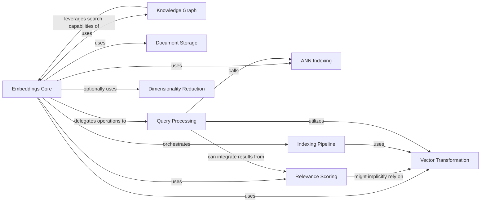

## Component Details

The Semantic Search & Indexing Engine in txtai is a sophisticated system designed for efficient and intelligent information retrieval, leveraging vector embeddings for semantic searches.

### Embeddings Core

This is the central orchestrator of the entire semantic search and indexing engine. It manages the complete lifecycle of embeddings, including their creation, indexing, updating, deletion, and querying. It acts as the primary interface for interacting with the search capabilities, coordinating operations across various specialized sub-components.

**Related Classes/Methods**:

- <a href="https://github.com/neuml/txtai/blob/master/src/python/txtai/embeddings/base.py#L0-L0" target="_blank" rel="noopener noreferrer">`txtai.embeddings.base` (0:0)</a>

### ANN Indexing

This component provides the underlying mechanism for Approximate Nearest Neighbor (ANN) search. It's responsible for building and querying highly efficient indexes of vector embeddings, allowing for rapid similarity lookups across vast datasets. It abstracts various ANN algorithms, enabling flexible backend choices.

**Related Classes/Methods**:

- <a href="https://github.com/neuml/txtai/blob/master/src/python/txtai/ann/base.py#L0-L0" target="_blank" rel="noopener noreferrer">`txtai.ann.base` (0:0)</a>

- <a href="https://github.com/neuml/txtai/blob/master/src/python/txtai/ann/factory.py#L0-L0" target="_blank" rel="noopener noreferrer">`txtai.ann.factory` (0:0)</a>

### Relevance Scoring

Beyond simple vector similarity, this component enhances search result quality by applying various relevance scoring algorithms, such as BM25 or TF-IDF. It helps to rank results based on contextual importance and term frequency, providing more nuanced and relevant outcomes.

**Related Classes/Methods**:

- <a href="https://github.com/neuml/txtai/blob/master/src/python/txtai/scoring/base.py#L0-L0" target="_blank" rel="noopener noreferrer">`txtai.scoring.base` (0:0)</a>

- <a href="https://github.com/neuml/txtai/blob/master/src/python/txtai/scoring/factory.py#L0-L0" target="_blank" rel="noopener noreferrer">`txtai.scoring.factory` (0:0)</a>

### Knowledge Graph

This component provides functionalities for managing and querying knowledge graphs. It allows for the storage of entities and their relationships, enabling complex relational queries, knowledge discovery, and topic modeling within the indexed data.

**Related Classes/Methods**:

- <a href="https://github.com/neuml/txtai/blob/master/src/python/txtai/graph/base.py#L0-L0" target="_blank" rel="noopener noreferrer">`txtai.graph.base` (0:0)</a>

- <a href="https://github.com/neuml/txtai/blob/master/src/python/txtai/graph/factory.py#L0-L0" target="_blank" rel="noopener noreferrer">`txtai.graph.factory` (0:0)</a>

### Vector Transformation

This component is responsible for converting raw input data (e.g., text, images) into numerical vector embeddings. It utilizes various pre-trained or custom models to generate these dense representations, which are fundamental for semantic understanding and similarity calculations.

**Related Classes/Methods**:

- <a href="https://github.com/neuml/txtai/blob/master/src/python/txtai/vectors/factory.py#L0-L0" target="_blank" rel="noopener noreferrer">`txtai.vectors.factory` (0:0)</a>

- <a href="https://github.com/neuml/txtai/blob/master/src/python/txtai/vectors/base.py#L0-L0" target="_blank" rel="noopener noreferrer">`txtai.vectors.base` (0:0)</a>

### Document Storage

This component manages the persistence and retrieval of the original document content associated with the generated embeddings. It provides a database layer to store the raw data, ensuring that the full context of search results is available.

**Related Classes/Methods**:

- <a href="https://github.com/neuml/txtai/blob/master/src/python/txtai/database/factory.py#L0-L0" target="_blank" rel="noopener noreferrer">`txtai.database.factory` (0:0)</a>

- <a href="https://github.com/neuml/txtai/blob/master/src/python/txtai/database/base.py#L0-L0" target="_blank" rel="noopener noreferrer">`txtai.database.base` (0:0)</a>

### Indexing Pipeline

This component encapsulates the internal processes involved in building and updating the embeddings index. It handles data streaming, transformations (e.g., dimensionality reduction), and the management of internal document IDs, ensuring efficient and consistent index construction.

**Related Classes/Methods**:

- <a href="https://github.com/neuml/txtai/blob/master/src/python/txtai/embeddings/index/stream.py#L0-L0" target="_blank" rel="noopener noreferrer">`txtai.embeddings.index.stream` (0:0)</a>

- <a href="https://github.com/neuml/txtai/blob/master/src/python/txtai/embeddings/index/transform.py#L0-L0" target="_blank" rel="noopener noreferrer">`txtai.embeddings.index.transform` (0:0)</a>

- <a href="https://github.com/neuml/txtai/blob/master/src/python/txtai/embeddings/index/indexids.py#L0-L0" target="_blank" rel="noopener noreferrer">`txtai.embeddings.index.indexids` (0:0)</a>

- <a href="https://github.com/neuml/txtai/blob/master/src/python/txtai/embeddings/index/indexes.py#L0-L0" target="_blank" rel="noopener noreferrer">`txtai.embeddings.index.indexes` (0:0)</a>

### Query Processing

This component handles the entire query lifecycle, from parsing user input to executing searches and presenting results. It includes functionalities for transforming queries into vector representations, performing searches across the indexed data, explaining result relevance, and extracting keywords.

**Related Classes/Methods**:

- `txtai.embeddings.search.search` (0:0)

- <a href="https://github.com/neuml/txtai/blob/master/src/python/txtai/embeddings/search/explain.py#L0-L0" target="_blank" rel="noopener noreferrer">`txtai.embeddings.search.explain` (0:0)</a>

- <a href="https://github.com/neuml/txtai/blob/master/src/python/txtai/embeddings/search/terms.py#L0-L0" target="_blank" rel="noopener noreferrer">`txtai.embeddings.search.terms` (0:0)</a>

- `txtai.query.query` (0:0)

### Dimensionality Reduction

This component applies techniques like Principal Component Analysis (PCA) to reduce the dimensionality of embedding vectors. This process helps to reduce noise, improve storage efficiency, and potentially enhance the performance of ANN search by focusing on the most significant features.

**Related Classes/Methods**:

- `txtai.reducer.reducer` (0:0)

### [FAQ](https://github.com/CodeBoarding/GeneratedOnBoardings/tree/main?tab=readme-ov-file#faq)