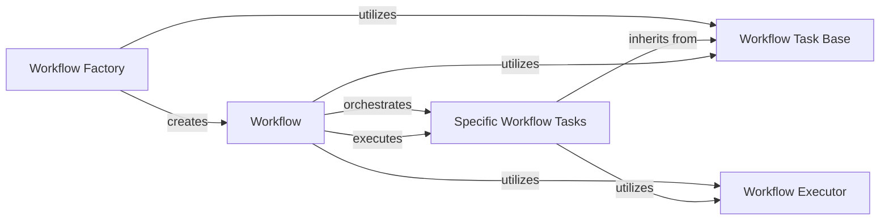

## Component Details

The Workflow Automation Engine in `txtai` is designed to orchestrate complex, multi-step AI tasks and data processing operations. It enables users to define and execute chained workflows, leveraging various `txtai` components to automate intricate data flows and AI model interactions.

### Workflow

This is the core component that encapsulates a series of tasks to be executed. It manages the overall flow, including task initialization, data processing, and finalization. It also provides methods for both immediate execution and scheduled runs.

**Related Classes/Methods**:

- <a href="https://github.com/neuml/txtai/blob/master/docker/aws/workflow.py#L0-L0" target="_blank" rel="noopener noreferrer">`Workflow:__call__` (0:0)</a>

- <a href="https://github.com/neuml/txtai/blob/master/docker/aws/workflow.py#L0-L0" target="_blank" rel="noopener noreferrer">`Workflow:schedule` (0:0)</a>

### Workflow Factory

This component is responsible for creating and configuring `Workflow` instances. It abstracts the complexity of instantiating workflows with various tasks, allowing for flexible and dynamic workflow definitions based on a configuration.

**Related Classes/Methods**:

- `WorkflowFactory:create` (0:0)

### Workflow Executor

This context manager is a crucial dependency used within the `Workflow` class, particularly in the `process` method. it manages a pool of workers (threads or processes) to enable concurrent execution of task actions, significantly speeding up processing for large datasets.

**Related Classes/Methods**:

- <a href="https://github.com/neuml/txtai/blob/master/src/python/txtai/workflow/execute.py#L0-L0" target="_blank" rel="noopener noreferrer">`Execute` (0:0)</a>

- <a href="https://github.com/neuml/txtai/blob/master/docker/aws/workflow.py#L0-L0" target="_blank" rel="noopener noreferrer">`Workflow:process` (0:0)</a>

### Workflow Task Base

This abstract base class defines the interface for all individual tasks that can be part of a workflow. It ensures that all tasks adhere to a common structure, allowing the `Workflow` class to uniformly manage and execute them. It provides methods for filtering, unpacking, packing, and executing actions on data elements.

**Related Classes/Methods**:

- `Task:initialize` (0:0)

- `Task:finalize` (0:0)

- `Task:__call__` (0:0)

- `Task:execute` (0:0)

### Specific Workflow Tasks

These are concrete implementations of various operations that a workflow can perform, such as console output, data export, file manipulation, image processing, data retrieval, service calls, storage operations, stream processing, template application, URL handling, and even nested workflows. Each task performs a specific unit of work within the overall workflow.

**Related Classes/Methods**:

- `Task:__call__` (0:0)

- `Task:__call__` (0:0)

- `Task:__call__` (0:0)

- `Task:__call__` (0:0)

- `Task:__call__` (0:0)

- `Task:__call__` (0:0)

- `Task:__call__` (0:0)

- `Task:__call__` (0:0)

- `Task:__call__` (0:0)

- `Task:__call__` (0:0)

- `Task:__call__` (0:0)

### [FAQ](https://github.com/CodeBoarding/GeneratedOnBoardings/tree/main?tab=readme-ov-file#faq)