```mermaid

graph LR

    Application_Orchestrator["Application Orchestrator"]

    Semantic_Search_Indexing_Engine["Semantic Search & Indexing Engine"]

    AI_Pipeline_Framework["AI Pipeline Framework"]

    Workflow_Automation_Engine["Workflow Automation Engine"]

    Data_Model_Management["Data & Model Management"]

    External_Interfaces["External Interfaces"]

    Application_Orchestrator -- "Initializes and manages" --> Semantic_Search_Indexing_Engine

    Application_Orchestrator -- "Initializes and manages" --> AI_Pipeline_Framework

    Application_Orchestrator -- "Initializes and manages" --> Workflow_Automation_Engine

    External_Interfaces -- "Exposes" --> Application_Orchestrator

    Semantic_Search_Indexing_Engine -- "Utilizes" --> Data_Model_Management

    Semantic_Search_Indexing_Engine -- "Provides services to" --> Application_Orchestrator

    Semantic_Search_Indexing_Engine -- "Provides data/results to" --> AI_Pipeline_Framework

    AI_Pipeline_Framework -- "Utilizes" --> Data_Model_Management

    AI_Pipeline_Framework -- "Queries" --> Semantic_Search_Indexing_Engine

    AI_Pipeline_Framework -- "Provides tasks for" --> Workflow_Automation_Engine

    Workflow_Automation_Engine -- "Orchestrates tasks from" --> AI_Pipeline_Framework

    Application_Orchestrator -- "Manages" --> Workflow_Automation_Engine

    Data_Model_Management -- "Supports" --> Semantic_Search_Indexing_Engine

    Data_Model_Management -- "Supports" --> AI_Pipeline_Framework

    External_Interfaces -- "Interacts with" --> Application_Orchestrator

    click Application_Orchestrator href "https://github.com/neuml/txtai/blob/master/.codeboarding//Application_Orchestrator.md" "Details"

    click Semantic_Search_Indexing_Engine href "https://github.com/neuml/txtai/blob/master/.codeboarding//Semantic_Search_Indexing_Engine.md" "Details"

    click AI_Pipeline_Framework href "https://github.com/neuml/txtai/blob/master/.codeboarding//AI_Pipeline_Framework.md" "Details"

    click Workflow_Automation_Engine href "https://github.com/neuml/txtai/blob/master/.codeboarding//Workflow_Automation_Engine.md" "Details"

    click Data_Model_Management href "https://github.com/neuml/txtai/blob/master/.codeboarding//Data_Model_Management.md" "Details"

    click External_Interfaces href "https://github.com/neuml/txtai/blob/master/.codeboarding//External_Interfaces.md" "Details"

```

## Component Details

The `txtai` architecture is designed around a modular and extensible core, primarily focused on semantic search, AI-powered text processing, and workflow automation. The analysis consolidates the initial components into six fundamental building blocks, each with distinct responsibilities and clear interaction pathways.

### Application Orchestrator

The central control unit of `txtai`, responsible for initializing, configuring, and managing all core functionalities. It acts as the primary entry point for the system, coordinating interactions between various components based on the application's configuration. It ensures that all services are properly set up and accessible.

**Related Classes/Methods**:

- <a href="https://github.com/neuml/txtai/blob/master/src/python/txtai/app/base.py#L1-L1" target="_blank" rel="noopener noreferrer">`txtai.app.base.Application` (1:1)</a>

### Semantic Search & Indexing Engine

The core engine for `txtai`'s semantic search capabilities. It handles the creation, indexing, and querying of vector embeddings, integrating Approximate Nearest Neighbor (ANN) algorithms, relevance scoring, and graph database functionalities to enable efficient and intelligent information retrieval and knowledge graph operations.

**Related Classes/Methods**:

- <a href="https://github.com/neuml/txtai/blob/master/src/python/txtai/embeddings/base.py#L1-L1" target="_blank" rel="noopener noreferrer">`txtai.embeddings.base.Embeddings` (1:1)</a>

- <a href="https://github.com/neuml/txtai/blob/master/src/python/txtai/ann/factory.py#L1-L1" target="_blank" rel="noopener noreferrer">`txtai.ann.factory.ANNFactory` (1:1)</a>

- <a href="https://github.com/neuml/txtai/blob/master/src/python/txtai/scoring/factory.py#L1-L1" target="_blank" rel="noopener noreferrer">`txtai.scoring.factory.ScoringFactory` (1:1)</a>

- <a href="https://github.com/neuml/txtai/blob/master/src/python/txtai/graph/base.py#L1-L1" target="_blank" rel="noopener noreferrer">`txtai.graph.base.Graph` (1:1)</a>

- <a href="https://github.com/neuml/txtai/blob/master/src/python/txtai/graph/factory.py#L1-L1" target="_blank" rel="noopener noreferrer">`txtai.graph.factory.GraphFactory` (1:1)</a>

### AI Pipeline Framework

A modular and extensible system for executing diverse AI-driven tasks, such as Retrieval Augmented Generation (RAG), audio transcription, text translation, data segmentation, and model training. It provides a factory for instantiating specific pipelines and abstracts the underlying model and data processing complexities, offering a consistent interface for various AI functionalities.

**Related Classes/Methods**:

- <a href="https://github.com/neuml/txtai/blob/master/src/python/txtai/pipeline/factory.py#L1-L1" target="_blank" rel="noopener noreferrer">`txtai.pipeline.factory.PipelineFactory` (1:1)</a>

- <a href="https://github.com/neuml/txtai/blob/master/src/python/txtai/pipeline/llm/rag.py#L1-L1" target="_blank" rel="noopener noreferrer">`txtai.pipeline.llm.rag.RAG` (1:1)</a>

- <a href="https://github.com/neuml/txtai/blob/master/src/python/txtai/pipeline/audio/transcription.py#L1-L1" target="_blank" rel="noopener noreferrer">`txtai.pipeline.audio.transcription.Transcription` (1:1)</a>

- <a href="https://github.com/neuml/txtai/blob/master/src/python/txtai/pipeline/text/translation.py#L1-L1" target="_blank" rel="noopener noreferrer">`txtai.pipeline.text.translation.Translation` (1:1)</a>

- <a href="https://github.com/neuml/txtai/blob/master/src/python/txtai/pipeline/data/segmentation.py#L1-L1" target="_blank" rel="noopener noreferrer">`txtai.pipeline.data.segmentation.Segmentation` (1:1)</a>

- <a href="https://github.com/neuml/txtai/blob/master/src/python/txtai/pipeline/train/hftrainer.py#L1-L1" target="_blank" rel="noopener noreferrer">`txtai.pipeline.train.hftrainer.HFTrainer` (1:1)</a>

### Workflow Automation Engine

Orchestrates complex, multi-step sequences of AI tasks and data processing operations. It allows users to define and execute chained workflows, leveraging the capabilities provided by the AI Pipeline Framework and other core `txtai` components to automate intricate data flows and AI model interactions.

**Related Classes/Methods**:

- <a href="https://github.com/neuml/txtai/blob/master/src/python/txtai/workflow/base.py#L1-L1" target="_blank" rel="noopener noreferrer">`txtai.workflow.base.Workflow` (1:1)</a>

- <a href="https://github.com/neuml/txtai/blob/master/src/python/txtai/workflow/factory.py#L1-L1" target="_blank" rel="noopener noreferrer">`txtai.workflow.factory.WorkflowFactory` (1:1)</a>

### Data & Model Management

Provides foundational services for loading, managing, and providing access to AI models (for vector generation and other tasks) and for persistent storage and retrieval of data. It abstracts the complexities of model handling, device management, and various database interactions (e.g., RDBMS, SQL processing), serving as a shared infrastructure layer.

**Related Classes/Methods**:

- <a href="https://github.com/neuml/txtai/blob/master/src/python/txtai/models/models.py#L1-L1" target="_blank" rel="noopener noreferrer">`txtai.models.models.Models` (1:1)</a>

- <a href="https://github.com/neuml/txtai/blob/master/src/python/txtai/vectors/factory.py#L1-L1" target="_blank" rel="noopener noreferrer">`txtai.vectors.factory.VectorsFactory` (1:1)</a>

- <a href="https://github.com/neuml/txtai/blob/master/src/python/txtai/database/factory.py#L1-L1" target="_blank" rel="noopener noreferrer">`txtai.database.factory.DatabaseFactory` (1:1)</a>

- <a href="https://github.com/neuml/txtai/blob/master/src/python/txtai/database/rdbms.py#L1-L1" target="_blank" rel="noopener noreferrer">`txtai.database.rdbms.RDBMS` (1:1)</a>

- <a href="https://github.com/neuml/txtai/blob/master/src/python/txtai/database/sql/base.py#L1-L1" target="_blank" rel="noopener noreferrer">`txtai.database.sql.base.SQL` (1:1)</a>

### External Interfaces

The layer responsible for exposing `txtai`'s functionalities to external users and applications. This includes a FastAPI-based web API for programmatic access (RESTful endpoints) and a command-line interface for direct user interaction, ensuring the system's capabilities are easily consumable.

**Related Classes/Methods**:

- <a href="https://github.com/neuml/txtai/blob/master/src/python/txtai/api/application.py#L1-L1" target="_blank" rel="noopener noreferrer">`txtai.api.application.Application` (1:1)</a>

- <a href="https://github.com/neuml/txtai/blob/master/src/python/txtai/console/base.py#L1-L1" target="_blank" rel="noopener noreferrer">`txtai.console.base.Console` (1:1)</a>

### [FAQ](https://github.com/CodeBoarding/GeneratedOnBoardings/tree/main?tab=readme-ov-file#faq)