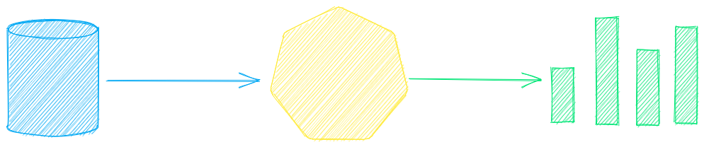

# Model guide

See the table below for the current recommended models. These models all allow commercial use and offer a blend of speed and performance.

| Component                                            | Model(s)                                                                 |
| ---------------------------------------------------- | ------------------------------------------------------------------------ |
| [Embeddings](../embeddings)                          | [all-MiniLM-L6-v2](https://hf.co/sentence-transformers/all-MiniLM-L6-v2) |
| [Image Captions](./pipeline/image/caption.md)        | [BLIP](https://hf.co/Salesforce/blip-image-captioning-base)              |
| [Labels - Zero Shot](./pipeline/text/labels.md)      | [DeBERTa v3 Zeroshot](https://hf.co/MoritzLaurer/deberta-v3-base-zeroshot-v2.0-c)                     |
| [Labels - Fixed](./pipeline/text/labels.md)          | Fine-tune with [training pipeline](./pipeline/train/trainer.md)          |
| [Large Language Model (LLM)](./pipeline/text/llm.md) | [Gemma 4 31B](https://hf.co/google/gemma-4-31B)                          |
| [Summarization](./pipeline/text/summary.md)          | [DistilBART](https://hf.co/sshleifer/distilbart-cnn-12-6)                |
| [Text-to-Speech](./pipeline/audio/texttospeech.md)   | [ESPnet JETS](https://hf.co/NeuML/ljspeech-jets-onnx)                    |
| [Transcription](./pipeline/audio/transcription.md)   | [Whisper](https://hf.co/openai/whisper-base)                             |
| [Translation](./pipeline/text/translation.md)        | [OPUS Model Series](https://hf.co/Helsinki-NLP)                          |

Models can be loaded as either a path from the Hugging Face Hub or a local directory. Model paths are optional, defaults are loaded when not specified. For tasks with no recommended model, txtai uses the default models as shown in the Hugging Face Tasks guide.

See the following links to learn more.

- [Hugging Face Tasks](https://hf.co/tasks)
- [Hugging Face Model Hub](https://hf.co/models)
- [Embeddings Leaderboard](https://hf.co/spaces/mteb/leaderboard)
- [LLM Leaderboard](https://hf.co/spaces/lmarena-ai/arena-leaderboard)
